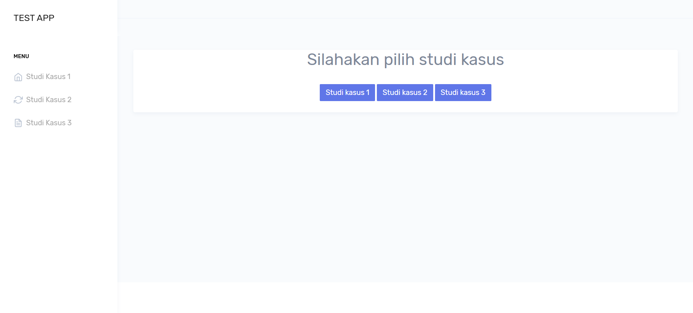
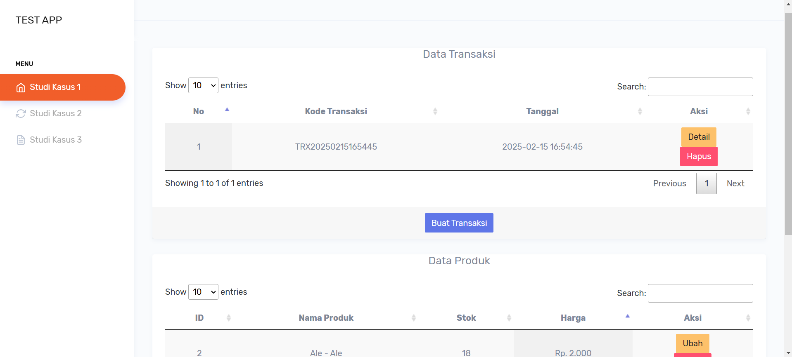
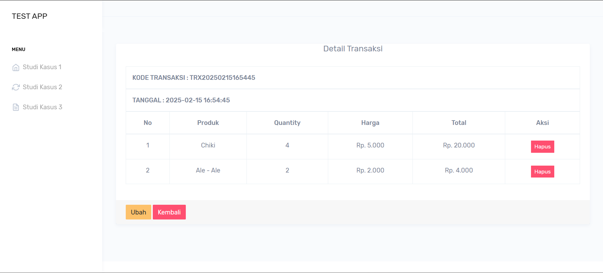
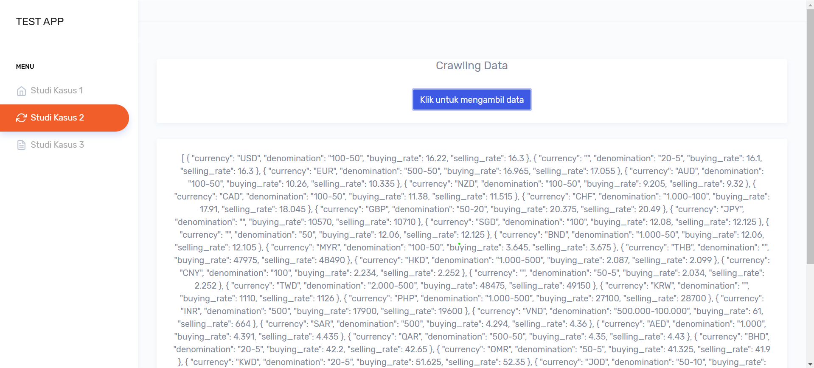
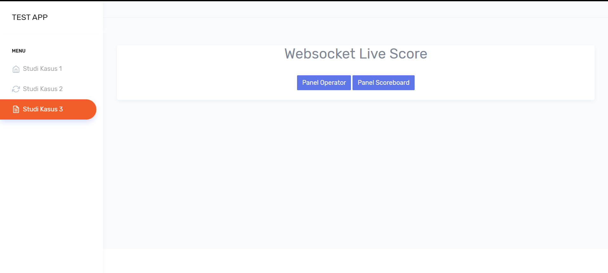
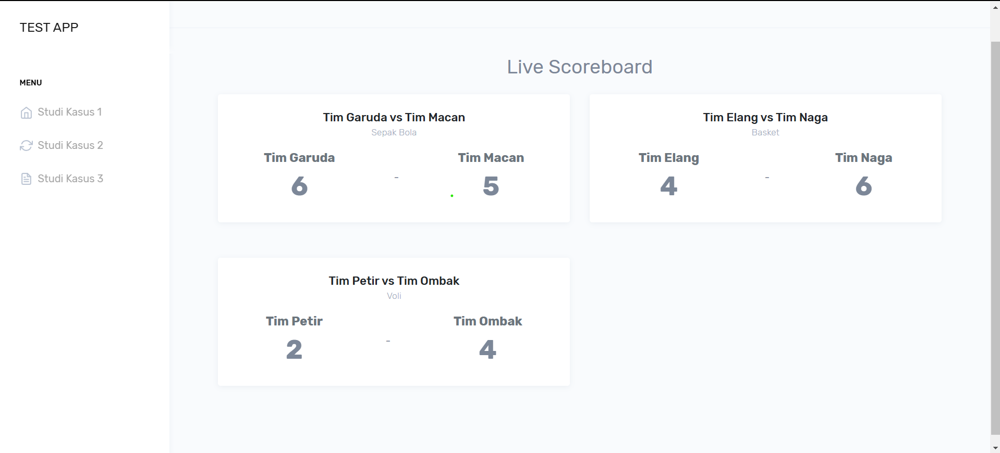
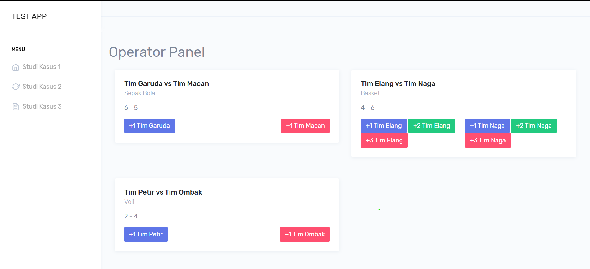

## **newtronic-test**  
Aplikasi berbasis web yang memiliki 3 menu berdasarkan studikasus pada soal test (CRUD, Crawling, dan Websocket). Dikembangkan menggunakan **Laravel**, **JavaScript**, **WebSocket**, dan **Bootstrap**.


---

## **Fitur Utama:**
- ⚡ **Menu Crud Transaksi dan Produk**
- 🎮 **Crawling Data**
- 🔑 **Live Score Menggunakan Websocket**

---

## **Tampilan Antarmuka:**
### **1. Menu Studikasus 1 (CRUD):**



### **2. Menu Studikasus 2 (CRAWL):**


### **3. Menu Studikasus 3 (WEBSOCKET):**




---

## **Teknologi yang Digunakan:**
- **Laravel** - Framework PHP untuk backend.
- **JavaScript (JQuery)** - Untuk interaksi front-end.
- **Bootstrap** - Desain responsif dan modern.
- **WebSocket (Pusher & Laravel Echo)** - Untuk real-time update.
- **MySQL** - Database penyimpanan skor dan log aktivitas.

---

## **Instalasi:**
1. **Clone Repository:**
   ```sh
   git clone https://github.com/Dikar15/newtronic-test.git
   cd newtronic-test
   ```

2. **Install Dependencies:**
   ```sh
   composer install
   npm install
   ```

3. **Copy .env File dan Generate Key:**
   ```sh
   cp .env.example .env
   php artisan key:generate
   ```

4. **Konfigurasi Database:**
   Sesuaikan konfigurasi database di `.env`:
   ```
   DB_CONNECTION=mysql
   DB_HOST=127.0.0.1
   DB_PORT=3306
   DB_DATABASE=nama_database
   DB_USERNAME=username
   DB_PASSWORD=password
   ```

5. **Migrasi dan Seed Database:**
   ```sh
   php artisan migrate --seed
   ```

6. **Jalankan Aplikasi:**
   ```sh
   php artisan serve
   npm run dev
   ```

---

## **Konfigurasi Pusher:**
Tambahkan konfigurasi Pusher di `.env`:
```
BROADCAST_DRIVER=pusher
PUSHER_APP_ID=1942567
PUSHER_APP_KEY=95520a7c8473b7735ccc
PUSHER_APP_SECRET=2e49dd1533287e07fec9
PUSHER_APP_CLUSTER=mt1
PUSHER_SCHEME=https
PUSHER_APP_USE_TLS=true
```

---

## **Pengembang:**
- Nama: Dika Ramdani
- Email: dikar151200@gmail.com
- GitHub: https://github.com/Dikar15

